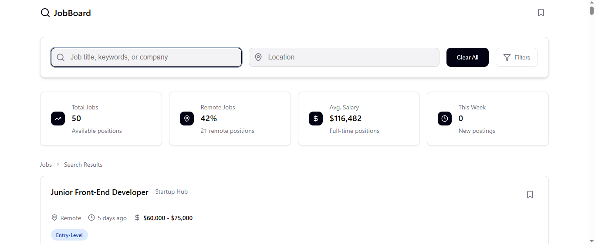
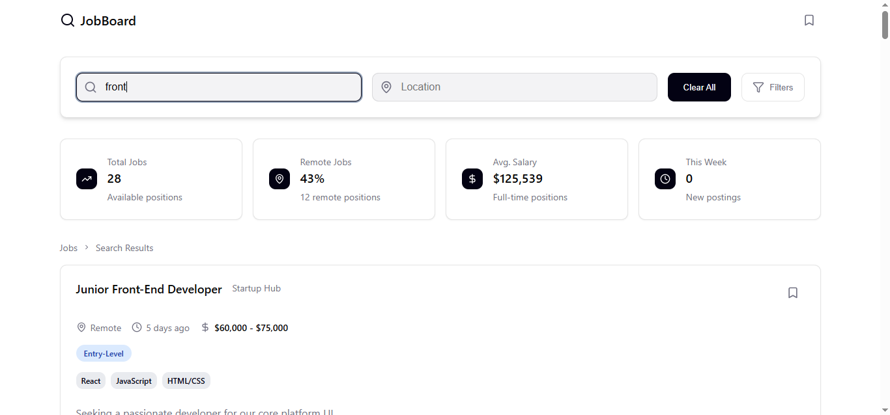

# JOB BOARD AGGREGATOR

A job search application built with React that allows users to search and filter job listings by keywords, location and other criteria.

## Features

- Search jobs by title, company, or keywords
- Filter by location
- Save jobs for later review
- View job statistics (total jobs, remote opportunities, average salary)
- Display required tech stack for each position
- Real-time filtering as you type

## Tech Stack

- React
- CSS Modules
- Lucide React for icons
- date-fns for date formatting

## Screenshots

## Installation & Setup

1. Clone the repository
   git clone https://github.com/slyskat/Job-Board-Aggregator.git
   cd job-board-aggregator

2. Install dependencies
   npm install

3. Start development server
   npm run dev

4. Open http://localhost:5173 in your browser

How it works
Job data is loaded from a JSON file and normalized for consistency.

Search filters apply case-insensitive matching across job titles, companies, and descriptions.

Location filtering works independently

Saved jobs are tracked in React state and persist during the session

FUTURE ENHANCEMENTS:

1. Advanced filters sidebar(experience level, salary range, remote only)
2. Sort options(date, salary)
3. Pagination
4. Persist saved jobs to localStorage
5. Job detail modal/page

WHAT I LEARNED:

1. Managing complex filter logic with multiple search criteria
2. Seperating UI state from data structure
3. Writing reusable utility functions with edge case handling
4. Component composition
5. Debugging react rendering issues

AUTHOR:
ABDULLAHI AYOMIDE
LinkedIn: www.linkedin.com/in/abdullahiayomide
GitHub: https://github.com/slyskat
