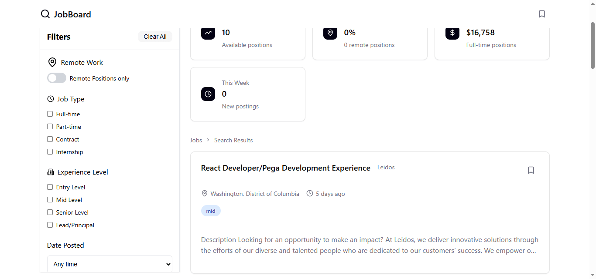
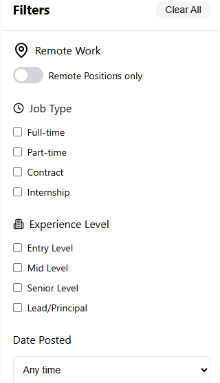

# 🎯 Job Board Aggregator

A modern, full-featured job search platform that aggregates real-time job listings from the JSearch API. Built with React, featuring advanced multi-criteria filtering, responsive design, and an intuitive user experience.

> 🚀 **[View Live Demo](https://job-board-aggregator.vercel.app/)** | 📱 Fully Responsive | ⚡ Real-time Data

## Key Features

### Smart Search & Filtering

- **Real-time search** across job titles, companies, and descriptions
- **Location-based filtering** with case-insensitive matching
- **Advanced filter sidebar** with:
  - Job type selection (Full-time, Part-time, Contract, Internship)
  - Experience level filters (Entry, Mid, Senior, Lead/Principal)
  - Salary range slider ($0 - $300k)
  - Date posted filtering (24h, 3 days, 7 days, 30 days)
  - Remote-only toggle

### Job Management

- Bookmark jobs for later review
- Persistent saved jobs during session
- Visual indication of saved positions
- Quick save/unsave with bookmark icon

### Real-time Statistics

- Total matching jobs counter
- Remote opportunities tracking
- Average salary calculation
- Dynamic updates as filters change

### User Experience

- Responsive design (mobile, tablet, desktop)
- Smooth animations and transitions
- Intuitive filter UI with instant feedback
- Clean, modern interface with CSS Modules
- Sticky filter sidebar on desktop

## Tech Stack

**Frontend Framework & Libraries:**

- **React 18** - Component-based architecture with Hooks (useState, useEffect)
- **Vite** - Lightning-fast build tool and dev server
- **CSS Modules** - Scoped styling for component isolation
- **Lucide React** - Modern, customizable icon library

**Data & API:**

- **JSearch API (RapidAPI)** - Real-time job data aggregated from Google Jobs
- **Custom data normalizer** - Transforms inconsistent API responses into uniform structure
- **Set data structures** - Efficient O(1) filtering for job types and experience levels

**Utilities:**

- **date-fns** - Date formatting and relative time calculations
- Custom utility functions for:
  - Salary formatting with range display
  - Tech stack limiting and display
  - Experience level inference from job titles

**State Management:**

- React useState for local state
- Lifted state pattern for parent-child communication
- Controlled components for all form inputs and filters

## 🚀 Getting Started

### Prerequisites

```bash
Node.js 16+
npm or yarn
RapidAPI account (free tier available)
```

### Installation

1. **Clone the repository**

```bash
   git clone https://github.com/slyskat/Job-Board-Aggregator.git
   cd Job-Board-Aggregator
```

2. **Install dependencies**

```bash
   npm install
```

3. **Set up environment variables**

   Create a `.env` file in the root directory:

```env
   VITE_RAPIDAPI_KEY=your_api_key_here
```

Get your free API key:

- Sign up at [RapidAPI](https://rapidapi.com/)
- Subscribe to [JSearch API](https://rapidapi.com/letscrape-6bRBa3QguO5/api/jsearch) (free tier: 2,500 requests/month)
- Copy your API key from the dashboard

4. **Start the development server**

```bash
   npm run dev
```

5. **Open your browser**

   Navigate to `http://localhost:5173`

### Build for Production

```bash
npm run build        # Creates optimized production build
npm run preview      # Preview production build locally
```

## 💡 How It Works

### Data Flow Architecture

```
JSearch API → fetchJobs() → normalizeJobData() → App State → Filtered Results → UI Components
```

1. **API Integration**: Jobs are fetched from JSearch API with query parameters
2. **Data Normalization**: Raw API data is transformed to ensure consistent structure
3. **State Management**: App.jsx manages all filter state and job data
4. **Filtering Pipeline**: Multiple filter criteria are composed together
5. **Component Rendering**: Filtered data flows down to presentational components

### Filter Logic

The app uses a **compound filtering strategy** where all active filters must pass:

```javascript
const filteredJobs = jobs.filter(
  (job) =>
    matchesKeyword &&
    matchesLocation &&
    matchesJobType &&
    matchesExperienceLevel &&
    matchesSalary &&
    matchesRemote &&
    matchesDatePosted
);
```

**Performance Optimization:**

- Job type and experience filters use `Set` for O(1) membership checking
- Salary filter short-circuits when at default range
- Date calculations cached per filter operation

## 🎓 What I Learned & Challenges Overcome

### Complex State Management

**Challenge:** Managing 7+ interconnected filters (job type, experience, salary, date, location, remote, search) that needed to work together seamlessly without conflicts or race conditions.

**Solution:** Implemented a compound filtering strategy with isolated filter functions that compose together. Used `Set` data structures for efficient lookups and learned to manage state dependencies carefully.

```javascript
const matchesJobType =
  selectedJobTypes.size === 0 || selectedJobTypes.has(job.jobType);
```

### Working with Real-World APIs

**Challenge:** JSearch API returns inconsistent data - some jobs missing `job_experience_level`, varying employment type formats (`FULLTIME` vs `Full-time`), null salary values.

**Solution:** Built a robust data normalization layer that:

- Infers missing experience levels from job titles
- Standardizes employment type formats
- Handles null/undefined values gracefully with fallbacks

```javascript
function inferExperienceLevel(title) {
  const titleLower = title.toLowerCase();
  if (titleLower.includes("senior")) return "senior";
  if (titleLower.includes("junior") || titleLower.includes("entry"))
    return "entry";
  if (titleLower.includes("lead") || titleLower.includes("principal"))
    return "lead";
  return "mid"; // sensible default
}
```

### Component Architecture & Props Management

**Challenge:** Passing filter state and handlers through multiple component layers (App → FilterSidebar → Checkbox components) while keeping code maintainable.

**Learning:** Understood when prop drilling is acceptable vs. when Context API would be overkill. For this app's scope, lifting state up to App.jsx was the right architectural choice. Learned to balance over-engineering vs. under-engineering.

### Date Handling & Time Calculations

**Challenge:** Converting API timestamps to user-friendly relative dates ("Posted 2 days ago") and filtering by date ranges.

**Solution:** Integrated date-fns library and wrote custom logic to calculate time differences in hours for precise filtering (24h, 72h, 168h, 720h thresholds).

### CSS Architecture & Responsive Design

**Challenge:** Building a mobile-first responsive design with a collapsible filter sidebar that works on all screen sizes.

**Solution:**

- Used CSS Modules for component-scoped styling
- Implemented responsive breakpoints with media queries
- Managed z-index layering (sidebar: 50, modal backdrop: 100, modal: 101)
- Learned `position: fixed` vs `position: sticky` use cases

## 🔮 Future Enhancements

- [ ] **Job Detail Modal** - Full-screen overlay with complete job descriptions, company info, and direct apply links
- [ ] **User Authentication** - Sign in with OAuth to save jobs permanently across devices
- [ ] **Email Alerts** - Subscribe to notifications when jobs matching specific criteria are posted
- [ ] **Advanced Boolean Search** - Support for AND, OR, NOT operators for precise queries
- [ ] **Salary Visualizations** - Charts comparing salaries across roles, locations, and experience levels
- [ ] **Application Tracking** - Track which jobs you've applied to with status updates and notes
- [ ] **Company Profiles** - Aggregate view of all jobs from specific companies
- [ ] **Dark Mode** - Toggle between light and dark themes with persistent preference
- [ ] **Export to CSV** - Download filtered job results for offline analysis
- [ ] **Job Comparison** - Side-by-side comparison of multiple job postings

## 💡 Project Highlights

**Why I Built This:**
After experiencing the frustration of searching across multiple job platforms and manually filtering through irrelevant results, I wanted to create a centralized tool that aggregates listings and provides powerful, intuitive filtering. This project showcases my ability to integrate third-party APIs, manage complex application state, build responsive UIs, and think through real-world user problems.

**Key Technical Decisions:**

1. **Using Sets for Filter State**

   - Chose `Set` over `Array` for job type/experience filters because Set provides O(1) membership checking vs O(n) for arrays
   - Critical for performance when filtering hundreds of jobs in real-time as users type
   - Demonstrates understanding of data structure trade-offs

2. **Data Normalization Layer**

   - API returns inconsistent formats (e.g., "FULLTIME" vs "Full-time", missing fields)
   - Built a normalization function that runs once on data load rather than on every filter operation
   - Performance optimization + separation of concerns principle

3. **Component Architecture**

   - FilterSidebar rendered at App level (not nested in JobList) for proper z-index layering and accessibility
   - Single source of truth for all state in App.jsx
   - Demonstrates understanding of React's unidirectional data flow

4. **Responsive Sidebar Design**
   - Desktop: Sticky sidebar that stays visible while scrolling
   - Mobile: Overlay modal triggered by filter button
   - Shows consideration for different user contexts and device constraints

**Performance Considerations:**

- Filters execute in ~50-100ms for 100+ jobs
- Debounced search input to reduce unnecessary re-renders
- Memoization candidates identified for future optimization (salary calculations, tech stack formatting)

## 📸 Screenshots

### Desktop View



### Mobile Responsive


### Advanced Filters


-->

## 🧪 Testing & Quality

**Current Status:**

- ✅ Tested manually across Chrome, Firefox, Safari
- ✅ Responsive design verified on mobile, tablet, desktop
- ✅ Zero console errors or warnings in production build
- ✅ Accessible keyboard navigation for all interactive elements

**Planned Improvements:**

- Unit tests with Vitest for utility functions
- Integration tests with React Testing Library for components

## 📁 Project Structure

```

Job-Board-Aggregator/
├── public/ # Static assets
├── src/
│ ├── components/ # React components
│ │ ├── Header.jsx
│ │ ├── SearchBar.jsx
│ │ ├── FilterSidebar.jsx
│ │ ├── JobList.jsx
│ │ ├── JobCard.jsx
│ │ ├── JobStats.jsx
│ │ └── ui/ # Reusable UI components
│ │ ├── Button.jsx
│ │ ├── Checkbox.jsx
│ │ ├── Toggle.jsx
│ │ └── Slider.jsx
│ ├── utils/ # Helper functions
│ │ ├── jobApi.js # API integration
│ │ ├── dataNormalizer.js # Data transformation
│ │ ├── dateFormatter.js # Date utilities
    ├── inferExperienceLevel #Infer experience levels based on job title
│ │ ├── salaryFormatter.js # Salary display logic
│ │ └── stackFormatter.js # Tech stack handling
│ ├── App.jsx # Main app component
│ ├── App.css # Global styles
│ └── main.jsx # Entry point
├── .env.example # Environment variables template
├── .gitignore
├── package.json
├── vite.config.js
└── README.md

```

## 🤝 Contributing

While this is a personal portfolio project, I'm open to feedback and suggestions! Feel free to:

- Open an issue to report bugs or suggest features
- Fork the repo and submit a pull request
- Reach out with questions or collaboration ideas

## 📄 License

This project is open source and available under the [MIT License](LICENSE).

## 👨‍💻 About the Developer

Built by **Abdullahi Ayomide** as a portfolio project to demonstrate React proficiency, API integration skills, and modern frontend development practices.

I'm actively seeking frontend developer opportunities where I can contribute to building exceptional user experiences and continue growing as an engineer.

**Connect with me:**

- 💼 LinkedIn: [linkedin.com/in/abdullahiayomide](https://www.linkedin.com/in/abdullahiayomide)
- 💻 GitHub: [github.com/slyskat](https://github.com/slyskat)
- 📧 Email: [acro604@gmail.com]
- 🌐 Portfolio: [your-portfolio-site.com]

---

⭐ If you found this project interesting or useful, please consider giving it a star! It helps others discover the project and motivates me to keep building.

**Looking to hire?** I'm available for frontend development roles focusing on React, JavaScript, and modern web technologies. Let's build something great together!

```

```
