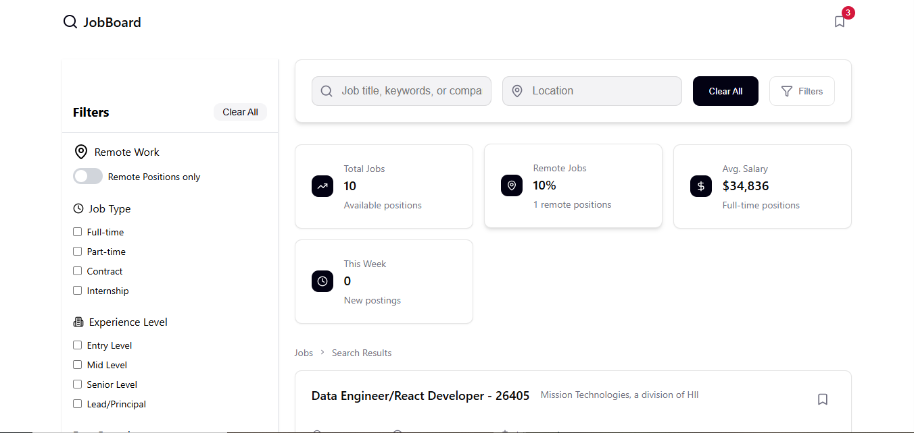
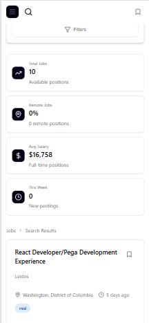
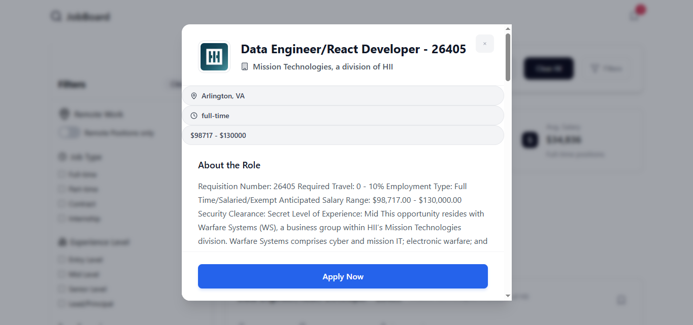

# Job Board Aggregator 💼

A robust, real-time job board application built with React. This application aggregates job listings via the JSearch API, featuring a normalized data layer, persistent state management, and a responsive filtering engine.

**[🚀 View Live Demo on Vercel](https://job-board-aggregator.vercel.app/)**

## 📸 App Gallery

<div align="center">
  
  <p><em>Desktop Dashboard with filtering enabled.</em></p>

  <br>

  
  
   <p><em>Responsive Mobile View and Job Details Modal.</em></p>
</div>

---

## ⚡ Key Features

- **Real-Time Data Integration:** Consumes the JSearch API to fetch live job postings.
- **Data Normalization Pattern:** Implements an adapter pattern to transform inconsistent API responses into a strict, type-safe structure for UI components.
- **Persistent State:** Uses a custom hook (`useLocalStorageState`) to persist bookmarked jobs across browser sessions (survives refreshes).
- **Smart Filtering:** Client-side filtering logic for Job Type, Experience Level, Salary Range, and Remote status.
- **Optimized UX:**
  - **Portals:** Uses React Portals for performant, accessible Modals (Job Details & Saved Jobs).
  - **Scroll Locking:** Prevents background scrolling when modals are active.
  - **Responsive Design:** Fully fluid layout built with CSS Modules (no heavy UI frameworks).

## 🛠️ Tech Stack

- **Core:** React (Vite), JavaScript (ES6+)
- **Styling:** CSS Modules (Scoped Styles)
- **Icons:** Lucide React
- **State Management:** React Hooks (`useState`, `useEffect`, `useMemo`, Custom Hooks)

## 🏗️ Architecture

This project avoids "prop drilling" by utilizing component composition and custom hooks. The `normalizeJobData` utility ensures that the frontend is decoupled from the specific shape of the API, making the application resilient to backend changes.

```javascript
// Example of Normalization Adapter
export const normalizeJobData = (apiData) => {
  return apiData.map((job) => ({
    id: job.job_id,
    title: job.job_title,
    // ... maps inconsistent API fields to clean UI props
  }));
};
```
